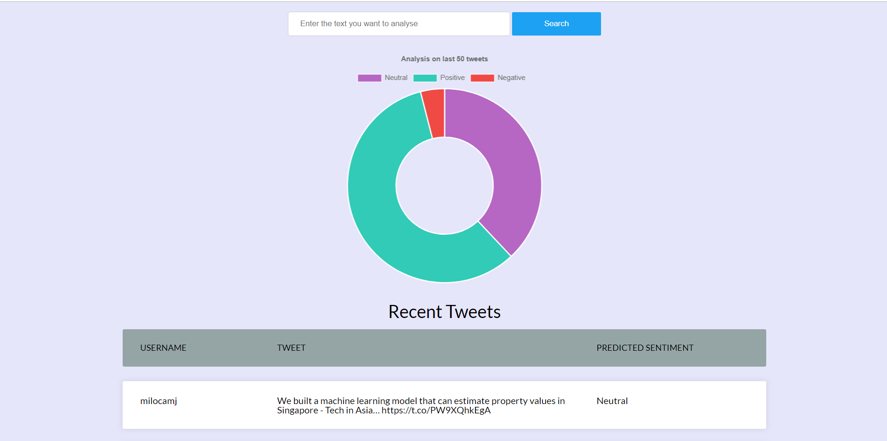

## Twitter Sentiment Analysis

A python program that lets you search for tweets and check if they have a positive or a negative impact.

Web/Demo: [Sentiment Analysis](https://sentiment-analysis-tweets.herokuapp.com)
 
 

